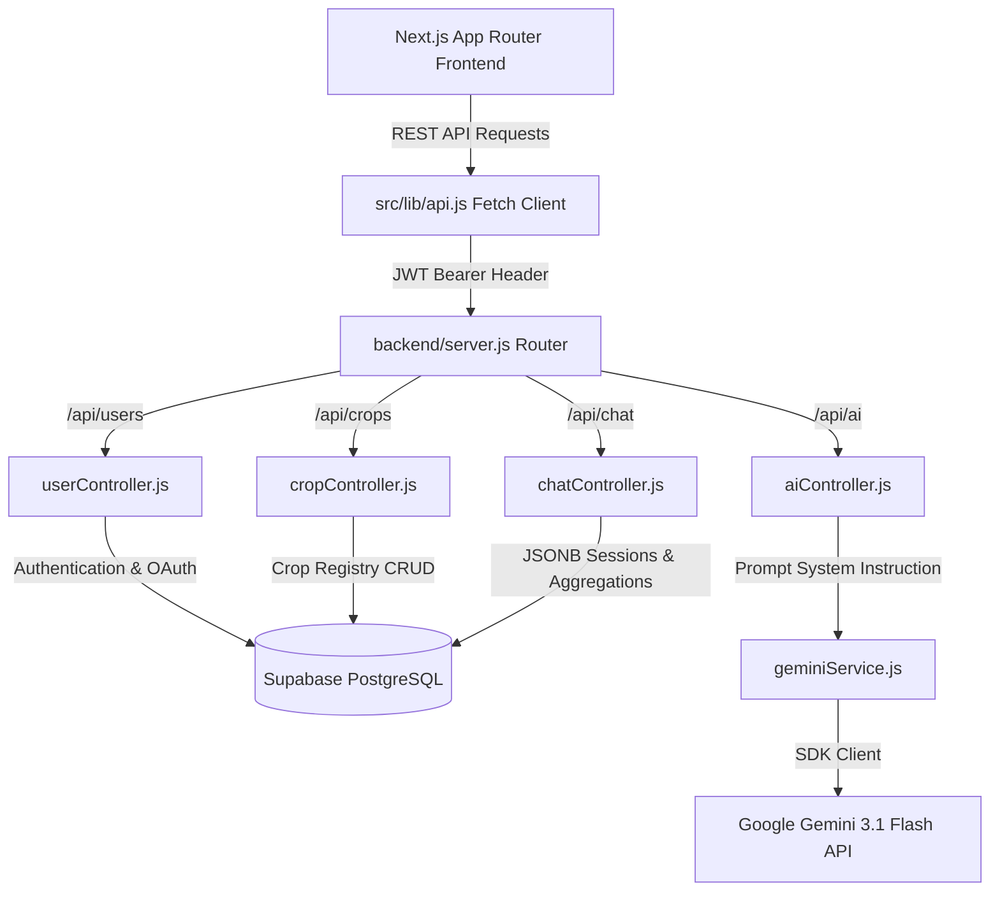
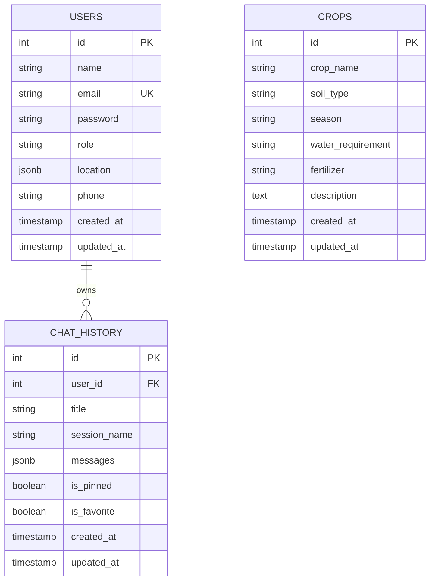

# System Architecture & Technical Walkthrough (Weeks 1–8)

This document provides a comprehensive technical walkthrough of the **AI-Powered Crop Advisory System for Uttarakhand Farmers**. It details system architecture, database design, authentication mechanisms, Google Gemini AI integration, persistent chat session management, Markdown rendering, and analytics dashboards.

---

## 1. System Architecture Diagram

---

## 2. Technical Stack Summary

| Component | Technology / Library | Description |
|:---|:---|:---|
| **Frontend Framework** | Next.js 16 (App Router), React 19 | Server & Client Components architecture |
| **Styling & Icons** | Vanilla CSS, TailwindCSS v4 | Sleek dark/light theme, custom cards & animations |
| **Backend Framework** | Node.js, Express.js | Modular REST API server |
| **Database** | Supabase PostgreSQL (`pg` pool) | Relational database with JSONB support |
| **Authentication** | JWT (`jsonwebtoken`), bcryptjs | Bearer token auth + Google OAuth 2.0 |
| **AI Integration** | `@google/generative-ai` SDK | Gemini 3.1 Flash API with system instructions |
| **Markdown Engine** | `react-markdown`, `remark-gfm` | Rich Markdown, code blocks, tables, formatting |
| **Analytics Charts** | `chart.js`, `react-chartjs-2` | Dynamically imported (`ssr: false`) Doughnut, Bar, Line charts |

---

## 3. Database Schema Overview

---

## 4. Feature Walkthrough (Week 8 Phases 1–7)

### Phase 1: Conversation Persistence
- PostgreSQL `chat_history` table automatically saves all user/assistant exchanges.
- Backend controller handles `POST /api/chat/save`, `GET /api/chat/history`, `GET /api/chat/history/:id`, and `DELETE /api/chat/history/:id`.
- Silent auto-save triggers in the background after every AI response without popups or UI interruptions.

### Phase 2: ChatGPT-Style Sidebar & Session Management
- Responsive left sidebar (desktop) and slide-over drawer (mobile).
- `+ New Chat` button resets session canvas.
- Inline title editing with Enter (save) and Escape (cancel).
- Auto title generation from the first user question when default title is used (e.g., "Wheat Fertilizer").

### Phase 3: Markdown Rendering & AI Message Formatting
- AI (`bot`) messages render full Markdown: Headings, bold/italic, bullet/numbered lists, blockquotes, horizontal rules, links opening in new tab.
- Styled code blocks with dark background (`bg-slate-900`), rounded borders, and horizontal overflow scrolling.
- Bordered, responsive markdown tables.
- **Copy Response Button** on each AI message card copying raw response text to clipboard with instant Toast feedback.
- **Auto-Scroll** smoothly anchoring to the bottom of the chat container on new messages.

### Phase 4: Chat Search & Conversation Management
- **Instant Search Bar** filtering conversations in real time by title or message content (case-insensitive). Displays `"No conversations found"` when empty.
- **Pinned Chats (📌)** pinned to top section with HTML5 drag-and-drop reordering.
- **Favorite Chats (⭐)** grouped in middle section.
- **Action Control Menu** on hover/active item for Pin/Unpin, Favorite/Unfavorite, Rename, Export, and Delete.

### Phase 5: Conversation Export & Import
- **Export (⬇)** downloads formatted JSON file `conversation-YYYY-MM-DD.json`.
- **Import (⬆)** opens hidden file picker, validates JSON payload structure, shows Toast `"Invalid conversation file."` on invalid input, and automatically inserts valid payload into history, refreshes sidebar, and opens the chat session.

### Phase 6: Conversation Analytics Dashboard
- Aggregated PostgreSQL query endpoint `GET /api/chat/analytics`.
- 8 statistic cards (Total Conversations, Total Messages, Favorites, Pinned Chats, Average Messages, Longest Chat, Oldest Date, Latest Date).
- Skeleton card loading state.
- 3 Chart.js visual charts dynamically imported:
  1. **Doughnut Chart**: Favorites vs Regular Conversations Ratio
  2. **Bar Chart**: Top Conversations by Message Count
  3. **Line Chart**: Conversation Growth Timeline

### Phase 7: Final Production Polish & Readiness
- Dynamic imports (`next/dynamic`) for heavy Chart.js modules.
- Accessibility attributes (`aria-label`, `aria-live`, `role="log"`, keyboard focus indicators).
- Production error handling hiding stack traces while returning structured JSON.
- Exhaustive documentation in `README.md` and `walkthrough.md`.

---

## 5. Verification Matrix & Testing Results

| Test Scenario | Executed Action | Expected Result | Status |
|:---|:---|:---|:---|
| **User Registration** | `POST /api/users/signup` with valid payload | Returns JWT token and user profile. | **PASS** |
| **User Login** | `POST /api/users/login` with credentials | Issues Bearer JWT token. | **PASS** |
| **Google OAuth** | Access `/api/users/google` | Redirects through OAuth callback to dashboard. | **PASS** |
| **Crop Registry CRUD** | GET, POST, PUT, DELETE `/api/crops` | Performs PostgreSQL CRUD with validation. | **PASS** |
| **AI Advisory Chat** | Send crop query on `/chatbot` | Gemini 3.1 Flash responds with Markdown advice. | **PASS** |
| **Silent Auto-Save** | Receive AI response | Conversation saves to PostgreSQL `chat_history`. | **PASS** |
| **Session Switching** | Click item in sidebar | Loads full conversation history. | **PASS** |
| **Instant Search** | Type query in sidebar search box | Filters by title & messages content; shows no results if empty. | **PASS** |
| **Pin / Favorite** | Click 📌 or ⭐ icon | Toggles pin/favorite state & updates list order. | **PASS** |
| **Export JSON** | Click ⬇ Export button | Downloads `conversation-YYYY-MM-DD.json`. | **PASS** |
| **Import JSON** | Upload valid `.json` file | Inserts conversation, refreshes sidebar, and opens session. | **PASS** |
| **Invalid Import** | Upload non-JSON or invalid schema | Displays `"Invalid conversation file."` toast. | **PASS** |
| **Markdown & Copy** | Inspect AI response bubble | Renders Markdown tables/lists & copies text on click. | **PASS** |
| **Analytics Dashboard**| Load `/dashboard` | Displays 8 stat cards and 3 Chart.js charts. | **PASS** |
| **Next.js Build** | Run `npm run build` | Compiles 13 App Router routes with zero errors. | **PASS** |
